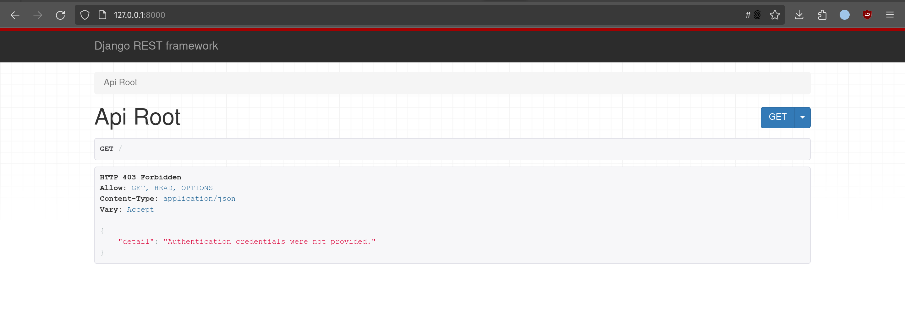
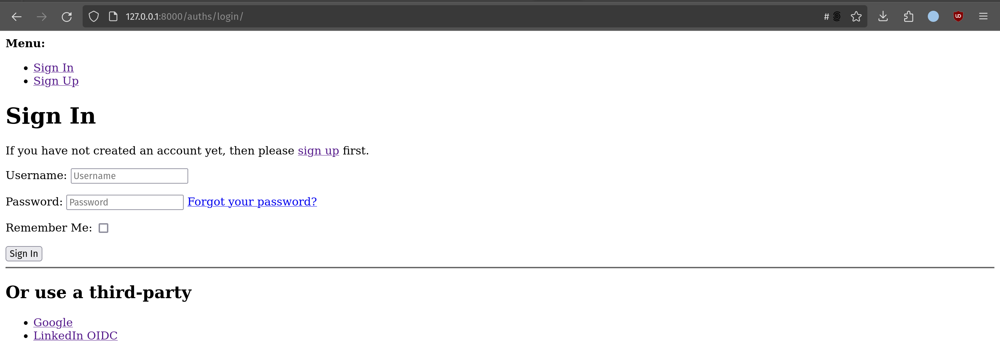
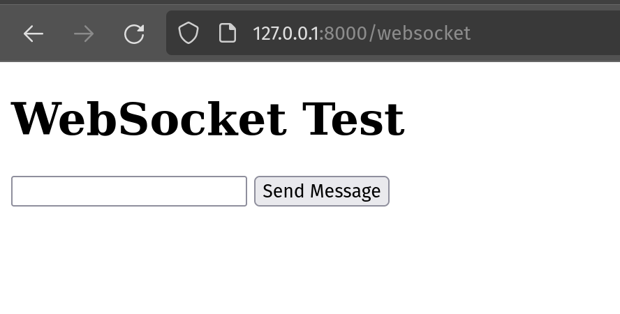
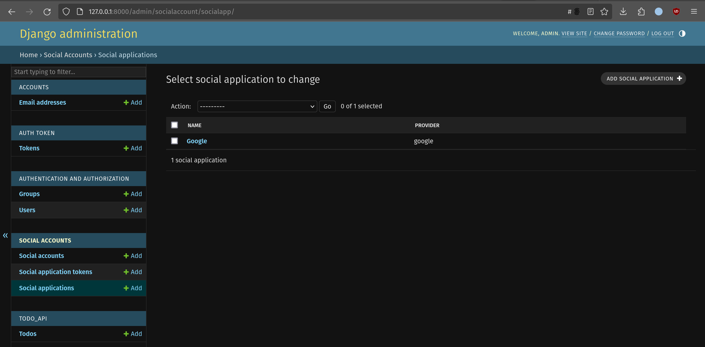
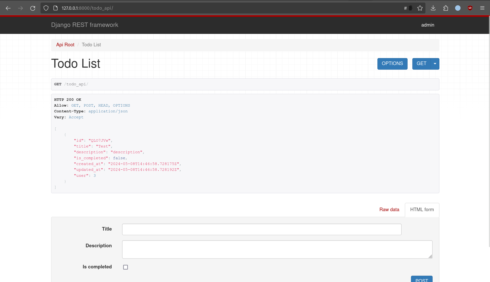

# Simple Backend Todo App
## Create a backend service for a Todo App with the following specifications:
- user can login/signup using Linkedin SSO and Google SSO
- user can login/signup using an email and password combination
- user can list,add,update and delete their todos
- If a user is logged in with the same credentials on two or more browsers, when they add, update, or delete a todo in one browser, it should sync to all browsers via socket (push mechanism
- Except for login/signup, other APIs and socket connections must be protected.

## Result
### First time access on url

### Login page on `base_url/auths/`

### Websocket on `base_url/websocket/`

### Configure google and linkedin url via django admin

### Final home

NOTE: Coverage report included